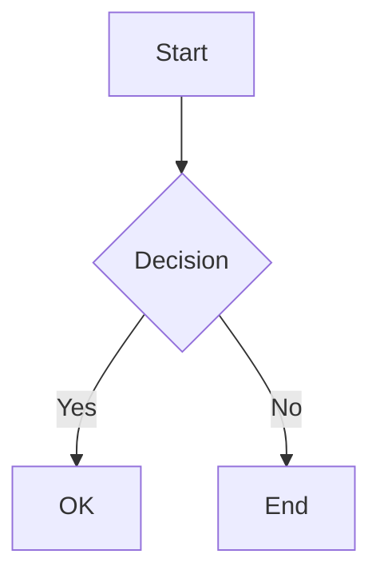

# Artifact Visualizer Demo

This document showcases all available renderers in the Artifact Visualizer.

## Mermaid Diagrams



## Code Blocks

```javascript
function hello() {
  return "Hello, World!";
}
```

```python
def greet(name):
    return f"Hello, {name}!"
```

## Tables

| Feature | Status | Notes |
|---------|--------|-------|
| Mermaid | ✓ | Flowcharts, sequence diagrams |
| Code | ✓ | Syntax highlighted |
| Tables | ✓ | Responsive |

## Lists

- Item 1
- Item 2
  - Nested 2a
  - Nested 2b
- Item 3

## Blockquotes

> This is a blockquote
> It can span multiple lines

## Frontmatter

```yaml
---
title: Example
author: User
date: 2024-01-01
---
```

## Math (LaTeX)

Inline math: $E = mc^2$

Block math:
$$\int_{-\infty}^{\infty} e^{-x^2} dx = \sqrt{\pi}$$